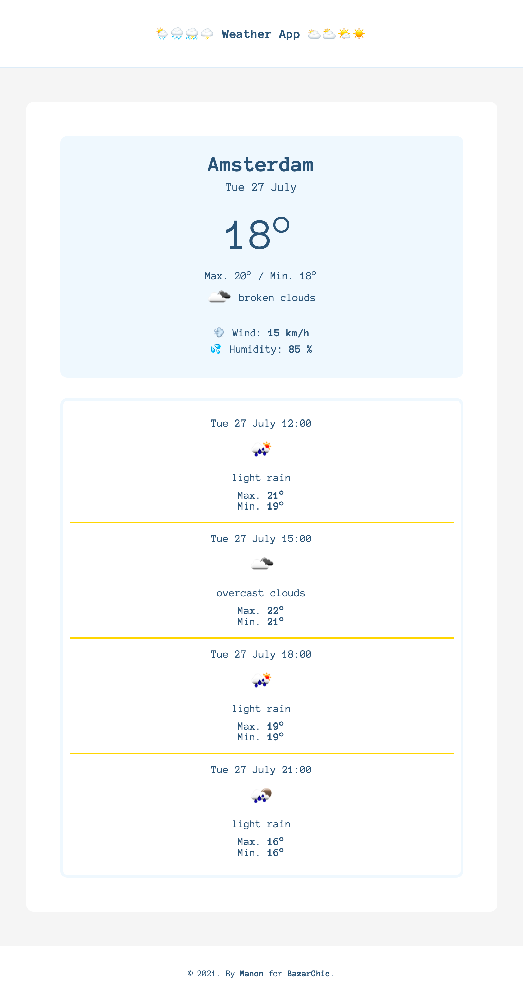
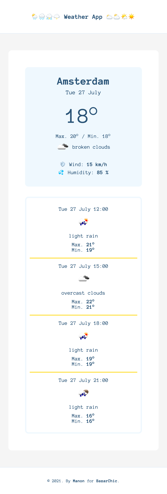

# WEATHER APP ❄️🍃☀️🍂

☀️ July 2021  
✨ Frontend - ReactJS  
🔗 Netlify - check [that](https://weather-test-2021.netlify.app/)

## 🌈 Overview - Welcome

---

Weather App for Amsterdam city.  
3 screens are availables: desktop, tablette, mobile.

  
  

## 👩🏻‍💻 Tasks

---

✘ Create a full React single page for the weather  
✘ Imagine the layout  
✘ Display the temperature of a city of my choice  
✘ Make the responsive design of the app  
✘ Manipulate styled-components  
✘ Send requests - [API Open Weather Map](https://openweathermap.org/)

## 📚 Stacks

---

[Javascript](https://www.w3schools.com/js/default.asp)  
[ReactJS](https://fr.reactjs.org/docs/getting-started.html)  
[HTML5](https://www.w3schools.com/html/default.asp)  
[CSS3](https://www.w3schools.com/css/default.asp)  
[Axios](https://github.com/axios/axios)  
[Styled Components](https://styled-components.com/)

## 🤯 Main difficulties

---

✘ To get all the data I needed (I manage to get the forecast for every 3 hours but not by day).

## 🔜 To be improved

---

✘ The use of styled-components (& TypeScript, not used in this exercice).

## 🗝 Installation and usage

---

Be sure, you have installed all dependencies to run the project.

### 🚙 Running the project

1️. Clone this repository

`git clone https://github.com/manon-boiteau/weather-app.git`  
`cd weather-app`

2️. Install packages

`npm install`  
or  
`yarn`

3️. When installation is complete:

`yarn start`
